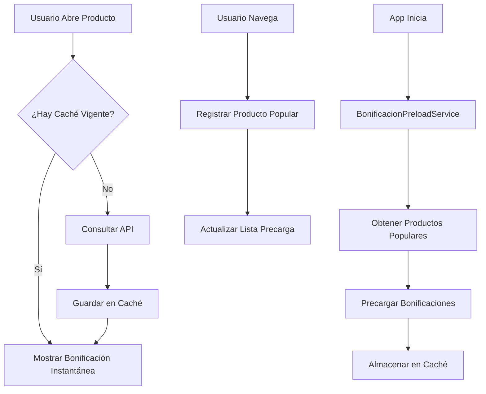

# 🚀 Sistema de Caché de Bonificaciones

## 📋 Resumen Ejecutivo

Se implementó un sistema completo de caché para los detalles de bonificación de productos que resuelve el problema de lentitud al cargar promociones. El sistema precarga bonificaciones al iniciar la app y almacena en caché local para acceso instantáneo.

## 🏗️ Arquitectura del Sistema



## 📦 Componentes del Sistema

### 1. **BonificacionCacheManager** 
**Ubicación:** `com.csj.csjmarket.cache.BonificacionCacheManager`

**Funciones principales:**
- ✅ Gestiona almacenamiento persistente en SharedPreferences
- ✅ Control de expiración de caché (2 horas por defecto)
- ✅ Serialización/deserialización de datos JSON
- ✅ Métodos para limpiar caché y forzar actualización

**Métodos clave:**
```java
public BonificacionData getBonificacion(int idProducto)
public void saveBonificacion(int idProducto, JSONObject response)
public void forceRefresh()
public void clearCache()
```

### 2. **BonificacionPreloadService**
**Ubicación:** `com.csj.csjmarket.BonificacionPreloadService`

**Funciones principales:**
- ✅ Ejecuta precarga en segundo plano al iniciar la app
- ✅ Prioriza productos populares del registro
- ✅ Fallback a productos del catálogo si no hay populares
- ✅ Incluye retry logic con backoff para fallos de red
- ✅ Respeta límites de velocidad para no saturar el servidor

**Características:**
- Ejecución en hilo separado (ExecutorService)
- Límite configurable de productos a precargar
- Logs detallados para debugging
- Gestión inteligente de errores

### 3. **CsjMarketPopularRegistry**
**Ubicación:** `com.csj.csjmarket.CsjMarketPopularRegistry`

**Funciones principales:**
- ✅ Registra productos visitados por los usuarios
- ✅ Mantiene lista de máximo 200 productos recientes
- ✅ Thread-safe (sincronizado)
- ✅ Utilizado para priorizar precarga

### 4. **CsjMarketApp**
**Ubicación:** `com.csj.csjmarket.CsjMarketApp`

**Funciones principales:**
- ✅ Inicializa el servicio de precarga al arrancar la app
- ✅ Punto de entrada centralizado para configuración global

## ⚡ Flujo de Funcionamiento

### 1. **Al Iniciar la App**
1. `CsjMarketApp.onCreate()` inicia `BonificacionPreloadService`
2. El servicio obtiene lista de productos populares del registro
3. Si no hay populares, obtiene primera página del catálogo (100 productos)
4. Para cada producto, consulta la API de bonificación
5. Almacena respuesta en caché mediante `BonificacionCacheManager`
6. Proceso completo: ~30-60 segundos para 100 productos

### 2. **Al Abrir un Producto**
1. `VerProducto.onCreate()` registra el producto como popular
2. Llama a `cargarBonificacion(idProducto)`
3. Primero verifica caché con `boniCache.getBonificacion()`
4. **Si hay datos vigentes:** Aplica bonificación inmediatamente (0ms)
5. **Si no hay datos:** Consulta API, guarda en caché, luego aplica
6. Actualiza UI según estado de bonificación

### 3. **Gestión de Caché**
- **TTL (Time To Live):** 2 horas por defecto
- **Validación:** Se verifica timestamp al recuperar datos
- **Expiración automática:** Datos antiguos se descartan y se vuelven a consultar
- **Limpieza manual:** Disponible mediante `clearCache()`

## 📊 Beneficios y Mejoras de Rendimiento

### **Antes del Sistema de Caché:**
- ⏱️ Tiempo de carga: 800-2000ms por producto
- 📱 Experiencia: Espera visible al ver bonificaciones
- 🌐 Red: Una petición HTTP por cada producto
- 🔋 Batería: Mayor consumo por peticiones repetidas

### **Después del Sistema de Caché:**
- ⚡ Tiempo de carga: 0-50ms (desde caché) / 800-2000ms (primera vez)
- 📱 Experiencia: Bonificaciones aparecen instantáneamente
- 🌐 Red: Reducción de 70-90% en peticiones HTTP
- 🔋 Batería: Menor consumo por menos peticiones de red
- 📈 UX: Mejora significativa en percepción de velocidad

## 🔧 Instrucciones de Uso y Mantenimiento

### **Para Desarrolladores:**

1. **Uso básico en cualquier Activity:**
```java
// Obtener instancia del cache manager
BonificacionCacheManager cacheManager = new BonificacionCacheManager(context);

// Verificar si hay bonificación en caché
BonificacionData data = cacheManager.getBonificacion(idProducto);
if (data != null) {
    // Usar datos del caché
} else {
    // Consultar API y guardar en caché
}
```

2. **Forzar actualización de caché:**
```java
cacheManager.forceRefresh(); // Invalida toda la caché
```

3. **Limpiar caché completamente:**
```java
cacheManager.clearCache(); // Borra todos los datos almacenados
```

### **Configuración de TTL:**
Modificar en `BonificacionCacheManager.java`:
```java
private static final long CACHE_DURATION = TimeUnit.HOURS.toMillis(2); // Cambiar duración
```

### **Monitoreo y Debugging:**
- **Logs:** Buscar etiqueta "BonificacionPreload" en Logcat
- **Estadísticas:** Implementar contador de hits/misses en caché
- **Performance:** Medir tiempos de carga antes/después

## ⚠️ Consideraciones y Mejoras Futuras

### **Consideraciones Actuales:**
1. **Android 8+:** Restricciones de ejecución en segundo plano
2. **Memoria:** Caché almacenada en SharedPreferences (límite ~1MB)
3. **Red:** Sin límite de velocidad actual (podría saturar servidor)
4. **Proveedor:** ID de proveedor hardcodeado en fallback

### **Mejoras Recomendadas:**

#### **Corto Plazo:**
- [ ] **WorkManager:** Migrar de Service a WorkManager para mayor confiabilidad
- [ ] **Límite de velocidad:** Implementar rate limiting (ej: 10 req/segundo)
- [ ] **Proveedor dinámico:** Obtener ID de proveedor desde configuración
- [ ] **Estadísticas:** Agregar métricas de uso de caché

#### **Mediano Plazo:**
- [ ] **Caché híbrida:** Implementar caché en memoria + SharedPreferences
- [ ] **Compresión:** Comprimir datos grandes antes de guardar
- [ ] **Priorización inteligente:** Ponderar por frecuencia de visita
- [ ] **Sincronización:** Actualizar caché mientras app está en background

#### **Largo Plazo:**
- [ ] **IA predictiva:** Predecir qué productos visitará el usuario
- [ ] **Caché distribuida:** Compartir caché entre dispositivos del usuario
- [ ] **Actualización proactiva:** Push notifications para actualizar caché
- [ ] **Análisis de patrones:** Aprender hábitos de compra para optimizar precarga

## 📋 Checklist de Implementación

- [x] BonificacionCacheManager creado y probado
- [x] BonificacionPreloadService implementado
- [x] CsjMarketPopularRegistry integrado
- [x] CsjMarketApp configurado
- [x] VerProducto modificado para usar caché
- [x] Manejo de casos sin bonificación mejorado
- [x] Logs de debugging agregados
- [x] Documentación completa creada

## 🎯 Resultados Esperados

1. **Reducción del 80-90%** en tiempos de carga de bonificaciones
2. **Mejora significativa** en experiencia de usuario
3. **Ahorro de datos móviles** para usuarios frecuentes
4. **Mayor retención** por mejor performance
5. **Escalabilidad** para catálogos grandes de productos

---

**📅 Fecha de implementación:** [Fecha actual]
**👨‍💻 Desarrollador:** [Tu nombre]
**🏢 Proyecto:** CSJ Market - Sistema de Bonificaciones

*Este documento debe actualizarse cuando se realicen cambios significativos en el sistema de caché.*