# Sistema de Pedidos Offline - CSJ Market

## 1. Visión General

El sistema de pedidos offline permite a los usuarios completar sus compras sin bloquear el ERP, guardando los pedidos localmente en el dispositivo y sincronizándolos posteriormente en segundo plano.

### Problema actual:
- El ERP se congela durante la inserción de items del pedido
- Otras áreas de la empresa se ven afectadas por este bloqueo
- Los usuarios deben esperar hasta que termine la operación

### Solución propuesta:
- Guardar pedidos localmente en SQLite
- Sincronizar con el ERP en segundo plano
- Mejorar la experiencia del usuario y el rendimiento del sistema

## 2. Arquitectura Técnica

```mermaid
graph TD
    A[Usuario] -->|Completar compra| B[App Android]
    B -->|Guardar local| C[SQLite Local]
    B -->|Mostrar estado| D[UI Estado Pedido]
    
    E[Sync Service] -->|Leer pendientes| C
    E -->|Enviar a ERP| F[Sistema ERP]
    F -->|Respuesta| E
    E -->|Actualizar estado| C
    E -->|Notificar| G[Notificación Push]
    
    H[WorkManager] -->|Programar sync| E
    I[Connectivity Manager] -->|Detectar red| H
```



### Componentes principales:

1. **Capa de Datos Local (SQLite)**
   - Almacena pedidos pendientes
   - Gestiona estados de sincronización
   - Mantiene historial de intentos

2. **Sync Service**
   - Procesa pedidos en segundo plano
   - Gestiona reintentos automáticos
   - Maneja errores de sincronización

3. **WorkManager**
   - Programa sincronización periódica
   - Se ejecuta incluso si la app está cerrada
   - Respeta restricciones de batería y red

4. **UI de Estado**
   - Muestra estado de pedidos al usuario
   - Permite reintentos manuales
   - Notifica sincronización exitosa

## 3. Estructura de Base de Datos Local

### Tabla: `pedidos_pendientes`
```sql
CREATE TABLE pedidos_pendientes (
    id INTEGER PRIMARY KEY AUTOINCREMENT,
    id_local TEXT UNIQUE NOT NULL,
    id_erp TEXT,
    fecha_creacion TIMESTAMP DEFAULT CURRENT_TIMESTAMP,
    fecha_sincronizacion TIMESTAMP,
    estado_sincronizacion TEXT DEFAULT 'PENDIENTE',
    intentos_sincronizacion INTEGER DEFAULT 0,
    datos_pedido TEXT NOT NULL, -- JSON completo del pedido
    datos_items TEXT NOT NULL, -- JSON de items del pedido
    error_sincronizacion TEXT,
    usuario_id TEXT NOT NULL,
    total DECIMAL(10,2),
    metodo_pago TEXT,
    direccion_entrega TEXT
);
```

### Tabla: `historial_sincronizacion`
```sql
CREATE TABLE historial_sincronizacion (
    id INTEGER PRIMARY KEY AUTOINCREMENT,
    pedido_id_local TEXT NOT NULL,
    fecha_intento TIMESTAMP DEFAULT CURRENT_TIMESTAMP,
    resultado TEXT, -- 'EXITO', 'ERROR', 'TIMEOUT'
    mensaje_error TEXT,
    duracion_ms INTEGER,
    FOREIGN KEY (pedido_id_local) REFERENCES pedidos_pendientes(id_local)
);
```

### Índices recomendados:
```sql
CREATE INDEX idx_estado_fecha ON pedidos_pendientes(estado_sincronizacion, fecha_creacion);
CREATE INDEX idx_usuario_estado ON pedidos_pendientes(usuario_id, estado_sincronizacion);
CREATE INDEX idx_intentos ON pedidos_pendientes(intentos_sincronizacion);
```

## 4. Flujo de Proceso

### 4.1 Flujo de Compra Offline


### 4.2 Estados de Sincronización

| Estado | Descripción | Acción siguiente |
|--------|-------------|------------------|
| PENDIENTE | Pedido guardado localmente | Intentar sincronización |
| SINCRONIZANDO | En proceso de envío al ERP | Esperar resultado |
| SINCRONIZADO | Pedido procesado exitosamente | Ninguna |
| ERROR | Falló la sincronización | Reintentar según política |
| TIMEOUT | Tiempo agotado | Reintentar inmediatamente |

## 5. Implementación Técnica

### 5.1 Clase de Entidad Pedido

```kotlin
data class PedidoPendiente(
    val idLocal: String = UUID.randomUUID().toString(),
    val idERP: String? = null,
    val fechaCreacion: Date = Date(),
    val fechaSincronizacion: Date? = null,
    val estadoSincronizacion: EstadoSincronizacion = EstadoSincronizacion.PENDIENTE,
    val intentosSincronizacion: Int = 0,
    val datosPedido: String, // JSON
    val datosItems: String, // JSON
    val errorSincronizacion: String? = null,
    val usuarioId: String,
    val total: BigDecimal,
    val metodoPago: String,
    val direccionEntrega: String
)

enum class EstadoSincronizacion {
    PENDIENTE,
    SINCRONIZANDO,
    SINCRONIZADO,
    ERROR,
    TIMEOUT
}
```

### 5.2 DAO para SQLite

```kotlin
@Dao
interface PedidoPendienteDao {
    @Insert
    suspend fun insertar(pedido: PedidoPendiente): Long
    
    @Query("SELECT * FROM pedidos_pendientes WHERE estado_sincronizacion = 'PENDIENTE' ORDER BY fecha_creacion ASC")
    suspend fun obtenerPendientes(): List<PedidoPendiente>
    
    @Query("UPDATE pedidos_pendientes SET estado_sincronizacion = :estado, fecha_sincronizacion = :fecha, id_erp = :idERP WHERE id_local = :idLocal")
    suspend fun actualizarEstado(idLocal: String, estado: String, fecha: Date?, idERP: String?)
    
    @Query("UPDATE pedidos_pendientes SET intentos_sincronizacion = intentos_sincronizacion + 1, error_sincronizacion = :error WHERE id_local = :idLocal")
    suspend fun incrementarIntento(idLocal: String, error: String?)
    
    @Query("SELECT * FROM pedidos_pendientes WHERE usuario_id = :usuarioId ORDER BY fecha_creacion DESC")
    suspend fun obtenerPorUsuario(usuarioId: String): List<PedidoPendiente>
}
```

### 5.3 Sync Service con WorkManager

```kotlin
class PedidoSyncWorker(
    context: Context,
    params: WorkerParameters
) : CoroutineWorker(context, params) {
    
    private val pedidoRepository = PedidoRepository(context)
    private val erpService = ERPService()
    
    override suspend fun doWork(): Result {
        val pedidosPendientes = pedidoRepository.obtenerPendientes()
        
        if (pedidosPendientes.isEmpty()) {
            return Result.success()
        }
        
        return try {
            for (pedido in pedidosPendientes) {
                sincronizarPedido(pedido)
            }
            Result.success()
        } catch (e: Exception) {
            Result.retry()
        }
    }
    
    private suspend fun sincronizarPedido(pedido: PedidoPendiente) {
        try {
            // Marcar como sincronizando
            pedidoRepository.actualizarEstado(
                pedido.idLocal, 
                EstadoSincronizacion.SINCRONIZANDO
            )
            
            // Enviar al ERP
            val response = erpService.crearPedido(pedido)
            
            if (response.isSuccessful) {
                // Éxito
                pedidoRepository.actualizarEstado(
                    pedido.idLocal,
                    EstadoSincronizacion.SINCRONIZADO,
                    Date(),
                    response.idERP
                )
                
                // Notificar al usuario
                mostrarNotificacionExito(pedido)
            } else {
                // Error del servidor
                manejarError(pedido, response.mensajeError)
            }
            
        } catch (e: SocketTimeoutException) {
            // Timeout
            manejarTimeout(pedido)
        } catch (e: Exception) {
            // Otro error
            manejarError(pedido, e.message)
        }
    }
    
    private suspend fun manejarError(pedido: PedidoPendiente, error: String?) {
        val intentos = pedido.intentosSincronizacion + 1
        
        if (intentos >= MAX_INTENTOS) {
            // Máximo de intentos alcanzado
            pedidoRepository.actualizarEstado(
                pedido.idLocal,
                EstadoSincronizacion.ERROR
            )
            mostrarNotificacionError(pedido, "Máximo de intentos alcanzado")
        } else {
            // Reintentar más tarde
            pedidoRepository.incrementarIntento(pedido.idLocal, error)
        }
    }
    
    private suspend fun manejarTimeout(pedido: PedidoPendiente) {
        pedidoRepository.actualizarEstado(
            pedido.idLocal,
            EstadoSincronizacion.TIMEOUT
        )
        // Los timeouts se reintentan inmediatamente
    }
    
    companion object {
        private const val MAX_INTENTOS = 3
        private const val TAG_SYNC = "pedido_sync"
        
        fun programarSincronizacion(context: Context) {
            val constraints = Constraints.Builder()
                .setRequiredNetworkType(NetworkType.CONNECTED)
                .setRequiresBatteryNotLow(true)
                .build()
            
            val syncRequest = PeriodicWorkRequestBuilder<PedidoSyncWorker>(
                15, TimeUnit.MINUTES
            )
                .setConstraints(constraints)
                .addTag(TAG_SYNC)
                .build()
            
            WorkManager.getInstance(context)
                .enqueueUniquePeriodicWork(
                    TAG_SYNC,
                    ExistingPeriodicWorkPolicy.KEEP,
                    syncRequest
                )
        }
    }
}
```

## 6. Política de Reintentos

### Estrategia de Backoff Exponencial

```kotlin
class RetryPolicy {
    companion object {
        fun getRetryDelay(intentos: Int): Long {
            return when (intentos) {
                1 -> 30_000  // 30 segundos
                2 -> 300_000 // 5 minutos
                3 -> 900_000 // 15 minutos
                else -> 3_600_000 // 1 hora
            }
        }
        
        fun shouldRetry(intentos: Int, estado: EstadoSincronizacion): Boolean {
            return when (estado) {
                EstadoSincronizacion.ERROR -> intentos < 3
                EstadoSincronizacion.TIMEOUT -> intentos < 5
                else -> false
            }
        }
    }
}
```

## 7. Interfaz de Usuario

### 7.1 Estados visuales del pedido

```kotlin
@Composable
fun EstadoPedidoCard(pedido: PedidoPendiente) {
    Card(
        modifier = Modifier.fillMaxWidth(),
        backgroundColor = when (pedido.estadoSincronizacion) {
            EstadoSincronizacion.PENDIENTE -> Color(0xFFFFF3E0)
            EstadoSincronizacion.SINCRONIZANDO -> Color(0xFFE3F2FD)
            EstadoSincronizacion.SINCRONIZADO -> Color(0xFFE8F5E9)
            EstadoSincronizacion.ERROR -> Color(0xFFFFEBEE)
            EstadoSincronizacion.TIMEOUT -> Color(0xFFFFF3E0)
        }
    ) {
        Column(
            modifier = Modifier.padding(16.dp)
        ) {
            Text(
                text = "Pedido #${pedido.idLocal.take(8)}",
                style = MaterialTheme.typography.h6
            )
            
            Text(
                text = when (pedido.estadoSincronizacion) {
                    EstadoSincronizacion.PENDIENTE -> "⏳ Pendiente de sincronización"
                    EstadoSincronizacion.SINCRONIZANDO -> "🔄 Sincronizando..."
                    EstadoSincronizacion.SINCRONIZADO -> "✅ Sincronizado exitosamente"
                    EstadoSincronizacion.ERROR -> "❌ Error en sincronización"
                    EstadoSincronizacion.TIMEOUT -> "⏱️ Tiempo agotado - Reintentando"
                },
                color = when (pedido.estadoSincronizacion) {
                    EstadoSincronizacion.ERROR -> Color.Red
                    EstadoSincronizacion.SINCRONIZADO -> Color.Green
                    else -> Color.Gray
                }
            )
            
            if (pedido.estadoSincronizacion in listOf(
                    EstadoSincronizacion.ERROR, 
                    EstadoSincronizacion.TIMEOUT
                )) {
                Button(
                    onClick = { reintentarSincronizacion(pedido) },
                    modifier = Modifier.padding(top = 8.dp)
                ) {
                    Text("Reintentar ahora")
                }
            }
        }
    }
}
```

## 8. Configuración de WorkManager

### 8.1 Inicialización en Application class

```kotlin
class CSJMarketApplication : Application(), Configuration.Provider {
    
    override fun getWorkManagerConfiguration(): Configuration {
        return Configuration.Builder()
            .setMinimumLoggingLevel(android.util.Log.DEBUG)
            .build()
    }
    
    override fun onCreate() {
        super.onCreate()
        
        // Programar sincronización periódica
        PedidoSyncWorker.programarSincronizacion(this)
        
        // Escuchar cambios en conectividad
        val connectivityManager = getSystemService(Context.CONNECTIVITY_SERVICE) as ConnectivityManager
        val networkRequest = NetworkRequest.Builder()
            .addCapability(NetworkCapabilities.NET_CAPABILITY_INTERNET)
            .build()
            
        connectivityManager.registerNetworkCallback(
            networkRequest,
            object : ConnectivityManager.NetworkCallback() {
                override fun onAvailable(network: Network) {
                    super.onAvailable(network)
                    // Forzar sincronización inmediata cuando hay conexión
                    PedidoSyncWorker.programarSincronizacionInmediata(applicationContext)
                }
            }
        )
    }
}
```

## 9. Seguridad y Validación

### 9.1 Validación de datos antes de guardar

```kotlin
class PedidoValidator {
    fun validarPedido(pedido: PedidoPendiente): ValidationResult {
        val errores = mutableListOf<String>()
        
        if (pedido.total <= BigDecimal.ZERO) {
            errores.add("El total debe ser mayor a cero")
        }
        
        if (pedido.datosItems.isEmpty()) {
            errores.add("El pedido debe tener al menos un item")
        }
        
        if (pedido.usuarioId.isBlank()) {
            errores.add("Usuario no identificado")
        }
        
        return ValidationResult(errores.isEmpty(), errores)
    }
}

data class ValidationResult(
    val esValido: Boolean,
    val errores: List<String>
)
```

### 9.2 Encriptación de datos sensibles

```kotlin
class PedidoEncryption {
    fun encriptarDatos(datos: String): String {
        // Implementar encriptación AES para datos sensibles
        return AES.encrypt(datos, encryptionKey)
    }
    
    fun desencriptarDatos(datosEncriptados: String): String {
        return AES.decrypt(datosEncriptados, encryptionKey)
    }
}
```

## 10. Monitoreo y Métricas

### 10.1 Métricas de sincronización

```kotlin
data class MetricasSincronizacion(
    val totalPedidos: Int,
    val pedidosPendientes: Int,
    val pedidosSincronizados: Int,
    val pedidosConError: Int,
    val tiempoPromedioSincronizacion: Long,
    val tasaExito: Float
)

class MetricasRepository {
    suspend fun obtenerMetricas(): MetricasSincronizacion {
        // Calcular métricas basadas en datos locales
        return MetricasSincronizacion(
            totalPedidos = getTotalPedidos(),
            pedidosPendientes = getPedidosPorEstado(EstadoSincronizacion.PENDIENTE),
            pedidosSincronizados = getPedidosPorEstado(EstadoSincronizacion.SINCRONIZADO),
            pedidosConError = getPedidosPorEstado(EstadoSincronizacion.ERROR),
            tiempoPromedioSincronizacion = getTiempoPromedio(),
            tasaExito = calcularTasaExito()
        )
    }
}
```

## 11. Ventajas del Sistema

1. **No bloquea el ERP**: Los pedidos se procesan en segundo plano
2. **Mejor experiencia de usuario**: Compra rápida y confirmación inmediata
3. **Resiliente a fallos de red**: Funciona sin conexión
4. **Sincronización automática**: No requiere intervención del usuario
5. **Trazabilidad completa**: Historial de todos los intentos
6. **Escalable**: Puede manejar muchos pedidos simultáneamente

## 12. Consideraciones de Implementación

### Fase 1: Implementación básica (2-3 semanas)
- [ ] Crear esquema de base de datos local
- [ ] Implementar guardado local de pedidos
- [ ] Crear Sync Service básico
- [ ] Implementar WorkManager

### Fase 2: Mejoras de UX (1-2 semanas)
- [ ] Crear interfaz de estado de pedidos
- [ ] Implementar notificaciones push
- [ ] Añadir reintentos manuales
- [ ] Optimizar política de reintentos

### Fase 3: Características avanzadas (2-3 semanas)
- [ ] Encriptación de datos sensibles
- [ ] Métricas y monitoreo
- [ ] Gestión de conflictos
- [ ] Sincronización selectiva

## 13. Próximos Pasos

1. **Revisar la implementación actual** del flujo de compra
2. **Identificar puntos de integración** con el sistema existente
3. **Crear prototipo** con funcionalidad básica
4. **Testing exhaustivo** en ambiente de desarrollo
5. **Despliegue gradual** a usuarios piloto

¿Te gustaría que profundice en algún aspecto específico o que prepare el código para comenzar la implementación?