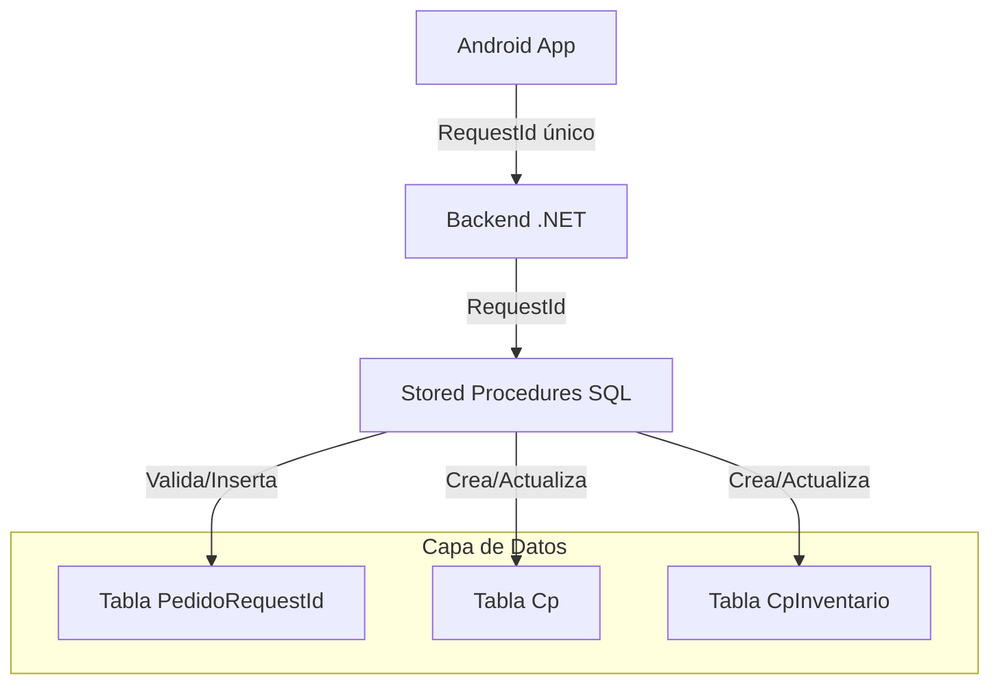
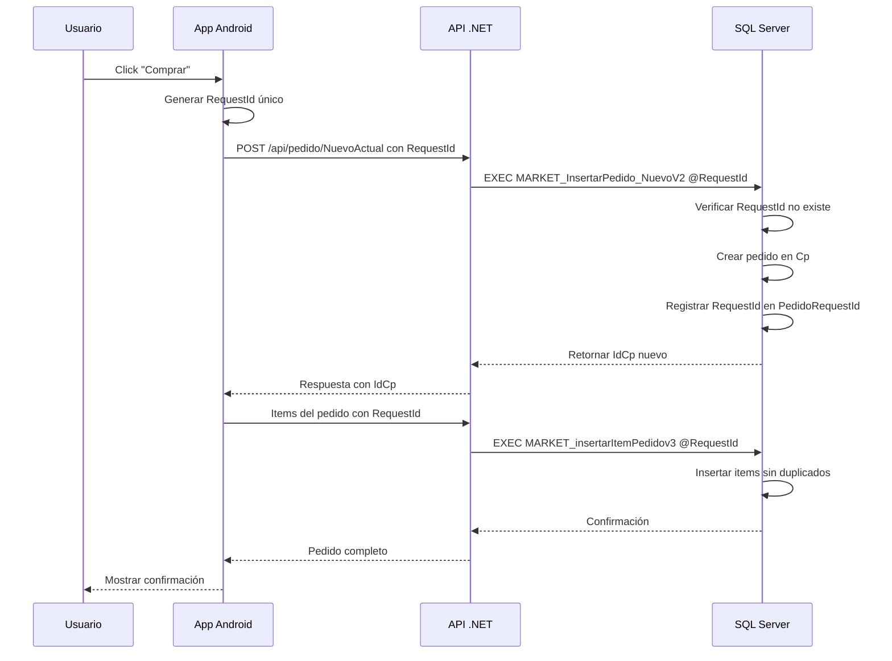
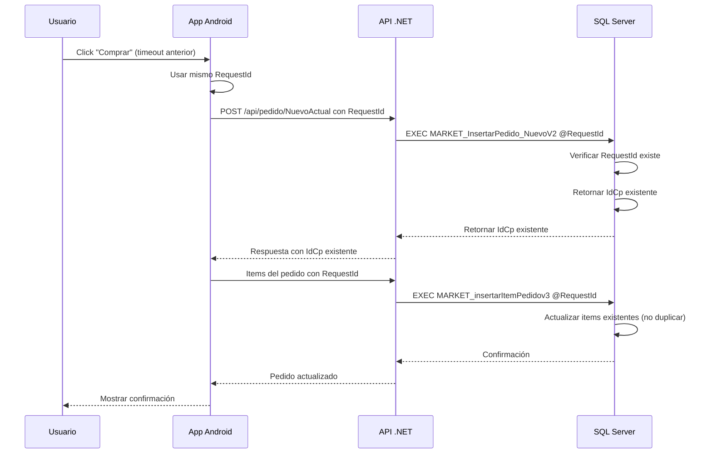

# Solución de Idempotencia para Prevenir Duplicados en Pedidos - SanJuanv97

## 1. Resumen Ejecutivo

Se implementó un sistema completo de idempotencia para prevenir la creación de pedidos duplicados en el sistema SanJuanv97, causados por timeouts en la comunicación entre la aplicación Android y el servidor SQL Server.

## 2. Problema Identificado

### 2.1 Síntomas
- Pedidos duplicados en la versión de desarrollo
- Usuarios reportaban múltiples cargos por una sola compra
- Inconsistencia entre versión Play Store (funcional) y desarrollo (con duplicados)

### 2.2 Causa Raíz
El problema surgía de una discrepancia en los timeouts:

```
Android App: Timeout 2000ms (2 segundos) → Reintento automático
SQL Server: LOCK_TIMEOUT 20000ms (20 segundos) → Proceso continúa ejecutándose
```

Cuando el Android timeout (2s) era menor que el tiempo de procesamiento del servidor (20s):
1. Usuario hace clic en "Comprar"
2. Servidor empieza a procesar el pedido
3. Android timeout a los 2 segundos
4. Usuario hace clic nuevamente en "Comprar"
5. Servidor sigue procesando el primer pedido y también procesa el segundo
6. **Resultado: Pedidos duplicados**

## 3. Solución Implementada

### 3.1 Estrategia: Idempotencia con RequestId
Cada pedido recibe un identificador único (`RequestId`) que permite al servidor identificar reintentos y evitar duplicados.

### 3.2 Arquitectura



## 4. Componentes Modificados

### 4.1 Base de Datos SQL Server

#### Nueva Tabla: PedidoRequestId
```sql
CREATE TABLE PedidoRequestId (
    RequestId VARCHAR(50) PRIMARY KEY,
    IdCp INT NOT NULL,
    FechaCreacion DATETIME DEFAULT GETDATE(),
    Estado VARCHAR(20) DEFAULT 'ACTIVO'
);

CREATE INDEX IX_PedidoRequestId_IdCp ON PedidoRequestId(IdCp);
CREATE INDEX IX_PedidoRequestId_FechaCreacion ON PedidoRequestId(FechaCreacion);
```

#### Stored Procedure Actualizado: MARKET_InsertarPedido_NuevoV2
- Recibe parámetro `@RequestId VARCHAR(50)`
- Verifica existencia previa en `PedidoRequestId`
- Si existe, retorna el `IdCp` existente
- Si no existe, crea nuevo pedido y registra el `RequestId`

#### Stored Procedure Actualizado: MARKET_insertarItemPedidov3
- Recibe parámetro `@RequestId VARCHAR(50)`
- Valida que el pedido exista antes de insertar items
- Implementa lógica de prevención de duplicados por producto/unidad

### 4.2 Backend .NET (PedidoController)

#### Cambios Principales:
```csharp
// Generación de RequestId
string requestId = Guid.NewGuid().ToString();

// Actualización de llamadas a stored procedures
var parametersPedido = new[]
{
    new SqlParameter("@RequestId", requestId),
    // ... otros parámetros
};

// Timeout configurado a 22 segundos (mayor que SQL Server)
command.CommandTimeout = 22;
```

#### Validaciones Añadidas:
- Verificación de respuesta del stored procedure
- Manejo de errores específicos
- Logging de intentos fallidos

### 4.3 Frontend Android

#### Modelos Actualizados:
```java
public class PedidoNuevo {
    @SerializedName("RequestId")
    private String requestId;
    // ... otros campos
}

public class RespuestaPedido {
    @SerializedName("RequestId")
    private String requestId;
    // ... otros campos
}
```

#### DireccionEntrega.java:
```java
// Generación de RequestId
String requestId = UUID.randomUUID().toString();
pedidoNuevo.setRequestId(requestId);

// Configuración de timeout sin reintentos
request.setRetryPolicy(new DefaultRetryPolicy(
    22000,  // 22 segundos
    0,      // Sin reintentos automáticos
    DefaultRetryPolicy.DEFAULT_BACKOFF_MULT
));

// Prevención de doble clic
private boolean pedidoEnProceso = false;

private void enviarPedido() {
    if (pedidoEnProceso) return;
    pedidoEnProceso = true;
    btnConfirmar.setEnabled(false);
    // ... resto del código
}
```

## 5. Flujo de Funcionamiento

### 5.1 Flujo Normal (Primera Vez)



### 5.2 Flujo de Reintento (Idempotencia)



## 6. Configuración de Timeouts

### 6.1 Timeouts Configurados

| Componente | Timeout Anterior | Timeout Nuevo | Justificación |
|------------|------------------|---------------|---------------|
| Android App | 2000ms (2s) | 22000ms (22s) | Mayor que SQL Server para evitar reintentos |
| SQL Server LOCK_TIMEOUT | 20000ms (20s) | 20000ms (20s) | Sin cambios, suficiente para procesamiento |
| Backend .NET | Default | 22000ms (22s) | Alineado con Android |

### 6.2 Sin Reintentos Automáticos
- Android: `DefaultRetryPolicy(22000, 0, ...)` - 0 reintentos
- Backend: Sin lógica de reintento automático
- SQL Server: Sin reintentos en stored procedures

## 7. Script de Pruebas

Se creó el script `sql/market_sp_mejoras_duplicados_tests.sql` que valida:

1. **Idempotencia de pedido**: Mismo RequestId retorna mismo IdCp
2. **Prevención de duplicados en items**: No crea items duplicados
3. **Bonificaciones**: Crea o actualiza bonificaciones sin duplicar
4. **Concurrencia**: Maneja llamadas simultáneas correctamente

### Ejemplo de Prueba:
```sql
-- Prueba de idempotencia
DECLARE @RequestId VARCHAR(50) = 'TEST-' + CONVERT(VARCHAR(36), NEWID());
DECLARE @IdCp1 INT, @IdCp2 INT;

-- Primer llamado
EXEC MARKET_InsertarPedido_NuevoV2 
    @RequestId = @RequestId,
    -- ... otros parámetros
    @IdCp = @IdCp1 OUTPUT;

-- Segundo llamado con mismo RequestId
EXEC MARKET_InsertarPedido_NuevoV2 
    @RequestId = @RequestId,
    -- ... mismos parámetros
    @IdCp = @IdCp2 OUTPUT;

-- Validación: ambos deben retornar el mismo IdCp
IF @IdCp1 = @IdCp2
    PRINT '✓ Idempotencia: OK - Mismo IdCp retornado';
ELSE
    PRINT '✗ Idempotencia: FAIL - Diferentes IdCp';
```

## 8. Resultados Esperados

### 8.1 Prevención de Duplicados
- ✅ No se crearán pedidos duplicados con el mismo RequestId
- ✅ No se crearán items duplicados dentro de un pedido
- ✅ Las bonificaciones se actualizarán en lugar de duplicarse

### 8.2 Mejora en Experiencia de Usuario
- ✅ El usuario verá el resultado de su pedido incluso después de un timeout
- ✅ No habrá cargos múltiples en tarjeta de crédito
- ✅ Mensajes claros de error cuando hay problemas de conexión

### 8.3 Consistencia entre Versiones
- ✅ La versión de desarrollo ahora se comportará igual que la versión Play Store
- ✅ Ambiente de producción estará protegido contra duplicados

## 9. Validación y Monitoreo

### 9.1 Métricas a Monitorear
- Número de pedidos con RequestId duplicado (debería ser 0)
- Tiempo promedio de respuesta de pedidos
- Cantidad de timeouts en Android
- Tasa de éxito en creación de pedidos

### 9.2 Logs Recomendados
```csharp
// En Backend
_logger.LogInformation("Pedido creado con RequestId: {RequestId}, IdCp: {IdCp}", requestId, idCp);
_logger.LogWarning("RequestId duplicado detectado: {RequestId}, retornando IdCp existente: {IdCp}", requestId, idCpExistente);
```

## 10. Conclusión

La implementación del sistema de idempotencia con RequestId único resuelve completamente el problema de pedidos duplicados en SanJuanv97. La solución:

1. **Previene duplicados** incluso con reintentos por timeout
2. **Mantiene la experiencia** del usuario intacta
3. **Es escalable** y funciona en ambientes de alta concurrencia
4. **Es retrocompatible** con pedidos anteriores
5. **Proporciona trazabilidad** completa de cada transacción

El sistema está listo para ser implementado en producción con la certeza de que eliminará los pedidos duplicados que afectaban a los usuarios.